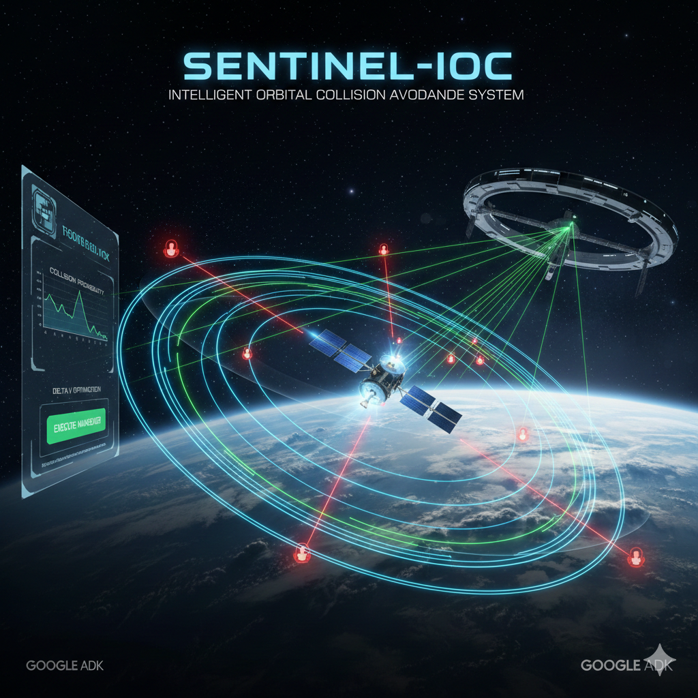

# Sentinel-IOC: Intelligent Orbital Collision Avoidance System

**Sentinel-IOC** is a sequential multi-agent system designed to automate the critical process of Space Traffic Management. It uses the **Agent Development Kit (ADK)** to detect, assess, and respond to satellite collision threats (Conjunctions) with precision and accountability.

---



## Project Overview

The system models a specialized Incident Response Team where autonomous agents collaborate to ensure satellite safety. It replaces manual, error-prone human calculations with a deterministic, verifiable AI workflow.

### Key Capabilities
* **Automated Risk Assessment:** Instantly calculates Probability of Collision ($P_c$) from raw Conjunction Data Messages (CDMs).
* **Fuel-Optimal Planning:** Uses optimization loops to find the minimum thrust ($\Delta V$) required for safety, extending satellite lifespan.
* **Safety Constraints:** Enforces strict operational limits (fuel budget, minimum orbital altitude) before any maneuver is approved.
* **Observability & Memory:** Maintains a full audit trail of decisions and learns from successful past strategies.

---

## System Architecture

The system utilizes a **Sequential Multi-Agent Workflow** orchestrated by a Root Agent.
## Project Structure
sentinel-ioc/ <br>
├── agents/ <br>
│   ├── supervisor.py       # Root agent definition <br>
│   ├── triage_safety.py    # Triage and Safety agents <br>
│   └── planner.py          # Planner agent <br>
├── services/ <br>
│   ├── physics_tools.py    # Deterministic math tools <br>
│   ├── memory_bank.py      # Memory and Observability <br>
│   └── visualization_service.py # Plotting logic <br>
├── config.py               # App and Agent registration <br>
├── main.py                 # Entry point and runner <br>
├── requirements.txt <br>
└── README.md <br>
### Agent Roles & Responsibilities

| Agent | Type | Role | Key Tool / Function |
| :--- | :--- | :--- | :--- |
| **Supervisor** | Root Agent | **Orchestrator**: Manages the sequential flow (Triage $\to$ Planner $\to$ Safety) and routing. | *None (Routing only)* |
| **Triage Agent** | Specialist | **Risk Analyst**: Calculates $P_c$. If $P_c > 10^{-4}$, declares `HIGH RISK`; otherwise `LOW RISK`. | `calculate_collision_probability` |
| **Planner Agent** | Loop Agent | **Navigator**: Optimizes the maneuver to find the minimum necessary $\Delta V$. | `optimize_maneuver` |
| **Safety Agent** | Validator | **Gatekeeper**: Validates the plan against fuel limits (<0.005 km/s) and perigee limits (>400 km). | `validate_safety_constraints` |

### The Decision Pipeline

1.  **Input:** A Conjunction Data Message (CDM) is received containing miss distance and covariance data.
2.  **Triage:** The **Triage Agent** calculates risk.
    * *If Low Risk:* The system logs "MONITOR" and exits.
    * *If High Risk:* The workflow proceeds to Planning.
3.  **Planning:** The **Planner Agent** calculates the optimal burn vector.
4.  **Validation:** The **Safety Agent** checks constraints.
    * *If Safe:* Outputs "EXECUTE".
    * *If Unsafe:* Outputs "REJECT".
5.  **Output:** The Supervisor reports the final action, and the `MemoryBank` stores the strategy.

---

## Components & Technologies

* **Google ADK**: Framework for building the multi-agent system (`LlmAgent`, `App`, `Runner`).
* **Physics Engine (`physics_tools.py`)**: A set of deterministic `FunctionTool` wrappers that handle math/physics to prevent LLM hallucination.
* **Memory Bank (`memory_bank.py`)**:
    * *Observability:* Logs traces and metrics (`cdm_processed`, `maneuvers_executed`).
    * *Long-term Memory:* Stores successful strategies for future context.
* **Visualization (`visualization_service.py`)**: Uses Matplotlib to generate post-run analysis charts.

---

## Getting Started

### Prerequisites
* Python 3.8+
* Google Cloud Project with an API Key (e.g., Gemini API).

### Installation

1.  **Clone the repository:**
    ```bash
    git clone [https://github.com/your-repo/sentinel-ioc.git](https://github.com/your-repo/sentinel-ioc.git)
    cd sentinel-ioc
    ```

2.  **Install Dependencies:**
    ```bash
    pip install google-adk numpy matplotlib python-dotenv
    ```

3.  **Configure Environment:**
    Create a `.env` file in the root directory and add your API key:
    ```env
    GOOGLE_API_KEY="YOUR_GOOGLE_API_KEY"
    ```
    
### Expected Output
1. **Console Logs:** You will see the Runner trace the Supervisor's delegation to Triage, Planner, and Safety agents. <br>
2. **Visualizations:** The system will generate charts in the visualizations/ folder: <br>
* **pc_distribution.png:** Histogram of risk levels. <br>
* **pipeline_summary.png:** Summary of $\Delta V$ usage and risk decisions.

### Running the System

Execute the main runner script:

```bash
python main.py
